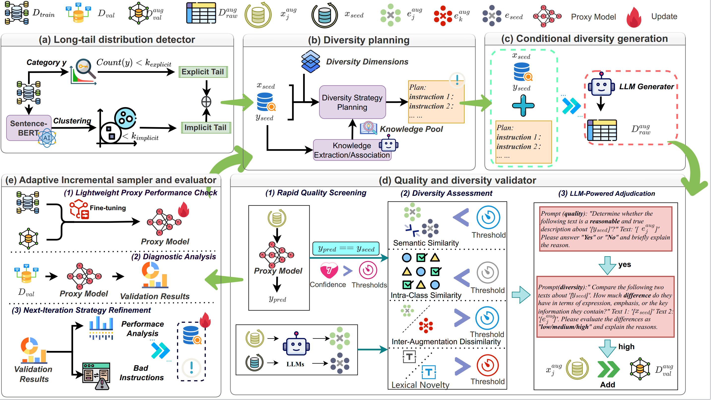

# DEALT: LLM-driven Diversity-Enhanced Data Augmentation for Long-Tail Text Classification

This repository contains the official implementation of the DEALT framework, an LLM-driven Adaptive Data Augmentation framework designed to address the challenges posed by long-tail data distributions in text classification.


## Model Architecture

The overall architecture of the DEALT framework is illustrated below:




## Getting Started

These instructions will get you a copy of the project up and running on your local machine for development and testing purposes.

### Prerequisites

*   Python 3.9 (recommended)
*   Access to the datasets mentioned in the Usage section.
*   Pre-trained language models (e.g., BERT, and an LLM for generation) as required by the framework's components.

### Environment Setup
Install the required dependencies using the provided `requirements.txt`:

```bash
    pip install -r requirements.txt
```


## Project Structure

The project follows the following directory structure:

```
dealt_project/
├── pretrain_models/
│   └── bert-base-cased/ 
├── data/
│   └── your_dataset_name/
│       ├── train.csv
│       ├── val.csv
│       └── test.csv
├── llm_api.py
├── utils.py
├── prompts.py
├── proxy_model.py
├── ldt.py
├── dp.py
├── cdg.py
├── qdv.py
├── aise.py
├── dealt.py
├── config.py
├── main.py
├── requirements.txt
└── README.md 
```

## Usage

To run the DEALT framework on the supported datasets:

1.  Ensure you have downloaded the following datasets and place them in the `data/` directory. Each dataset should ideally be in its own subdirectory (e.g., `data/ag_news/`, `data/yelp_review_polarity/`, etc.):
    *   AG News
    *   Yelp Reviews Polarity
    *   CLINC150
    *   HWU64
    *   TREC

2.  Place any required pre-trained models (like `bert-base-cased` or others used by the framework) into the `pretrain_models/` directory following a similar structure as shown in the Project Structure.

3.  Ensure your environment is set up as described in the "Environment Setup" section.

4.  Run the main script from the project root directory:
    ```bash
    python main.py --dataset dataset_name
    ```

